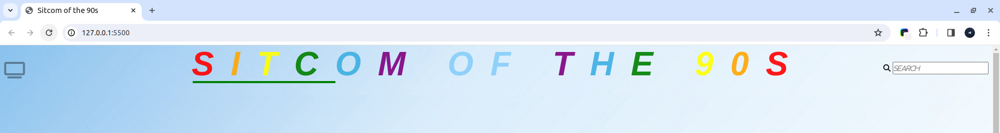
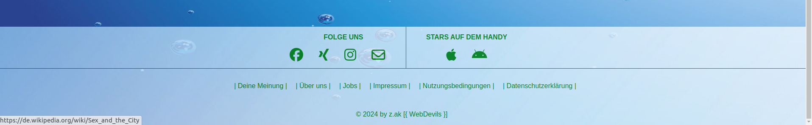
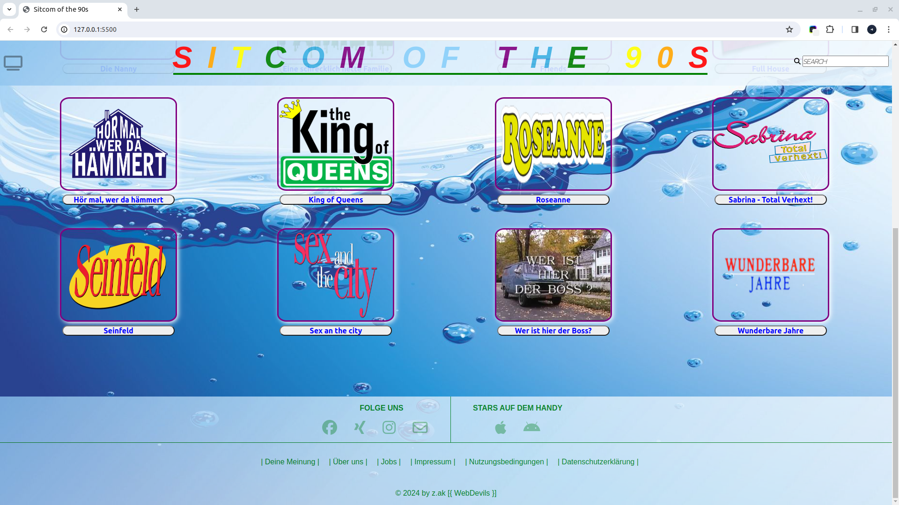

# ~ The TV Comedy Gallery ~
 
## Project description:

The gallery contains a small collection of the **series** from the **Comedy** category of the **90s**.
Some of the series appeared in the 80s and ended in the 90s. Others started in the 90s and extended until the beginning of the millennium.

e.g.
* _The Fresh Prince of Bel-Air_
* _A horrible nice family_
* _King of Queens_
* _Who is the boss?_
* _etc._

## Installation Guide:

### Clone repository:

1. On GitHub.com, navigate to the repository's main page.
2. Use the link below:

 `https://github.com/Tokhi-Naheeda/Comedy-Gallery-D`

1. Click on the green `"<> Code"` button above the list.
2. There are three or four options available to choose from.
   
   * _HTTPS LINK_
   
   * _SSH LINK_

   * _GitHub CLI LINK_

   * _Download ZIP_

3. Open TERMINAL, enter a target path (destination of the folder).
4. Click on the copy button to copy the link.
5. Enter the command **"git clone"** and paste the copied
   Add link. Press the right mouse button and click on `"Insert"`. Confirm with “Enter” to download the files.

    **!!! IMPORTANT !!!**
   
   The keyboard shortcut `"Ctrl + V"` for the `"Paste"` command is ineffective in the terminal!

6. If the data has been downloaded successfully, **Visual Studio Code** can be used directly in the terminal
   can be started with the command `"code ."`.
7. The repository can be edited.
    
## Use:

The page contains a header (header/nav) and a footer (footer). The CSS for the body (body/main) is built with the `"grid"` function. A hover is placed over the label field. By clicking on the field, the Wikipedia page opens in the same window, where information about the series is provided.

## Resources
  > [Normalize CSS](https://cdnjs.cloudflare.com/ajax/libs/normalize/8.0.1/normalize.min.css)
  - _Browser default_

  > [Font Awesome](https://fontawesome.com)
  - _Fonts and Icons Toolkit_

  > [Google Fonts](https://fonts.google.com/)
  - _Fonts_

  > [Images](https://www.google.com/imghp?hl=de&ogbl)
  - _Google & Wikipedia images_

  > [Background images](https://www.google.com/imghp?hl=de&ogbl)
  - _Google Pictures_
  
  > [Reading text](https://de.wikipedia.org/wiki/Wikipedia:Hauptseite)
  -Wikipedia

## Preview

